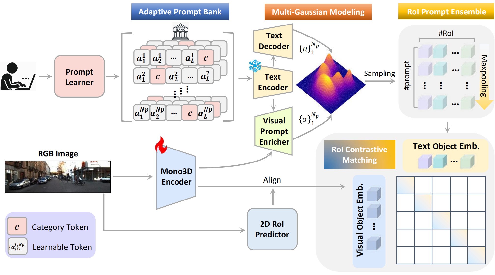

# VirPro: Visual-referred Probabilistic Prompt Learning for Weakly-Supervised Monocular 3D Detection

<!-- **Official PyTorch implementation of the CVPR 2026 submission**   -->

VirPro introduces a **new adaptive multimodal pretraining paradigm** that enriches weak supervision using **visually-referred probabilistic prompts**, significantly improving existing Weak-Supervised Monocular 3D Detection frameworks such as **[WeakM3D](https://github.com/SPengLiang/WeakM3D)** and **[GGA](https://github.com/gwenzhang/GGA)**, and achieving **up to +4.8% AP improvement** on KITTI.

---

## 🚀 Key Innovations

<!-- ### 🔮 Visually-Referred Probabilistic Prompts
Traditional static prompts cannot capture visual diversity.  
VirPro builds **instance-conditioned prompt distributions** that encode both **visual cues** and **semantic uncertainty**, enabling richer contextual learning. -->

### 🏦 Adaptive Prompt Bank (APB)
Multiple learnable prompts are assigned to each object instance by embedding class names into natural-language templates, enabling robust contextual representation learning.

### 📈 Multi-Gaussian Prompt Modeling (MGPM)
Prompt embeddings are enriched with visual cues and parameterized as multivariate Gaussian distributions, whose means encode canonical semantics while their variances model visual uncertainty.

<!-- ### 🎯 RoI-Level Contrastive Alignment
We enforce scene-aware vision–language alignment through **contrastive learning**, ensuring:
- intra-scene semantic coherence  
- inter-scene separability  
- cleaner latent structure (validated by Silhouette & CH scores) -->

<!-- ### 🧱 Drop-in Compatibility
VirPro integrates seamlessly into any WS-M3D pipeline:
- WeakM3D ✔  
- GGA+PGD ✔  
- Other pseudo-label or text-guided frameworks ✔ -->

---

## 🧩 Method Overview
Our paradigm adopts a two-stage training pipeline. In the first stage, as shown in the following figure, we introduce an Adaptive Prompt Bank (APB) to generate diverse, instance-specific prompts. We further propose Multi-Gaussian Prompt Modeling (MGPM), which injects visual cues into textual embeddings and represents each prompt as a multivariate Gaussian distribution. A unified prompt embedding is then sampled and normalized for each instance, followed by RoI-level Contrastive Matching to align monocular 3D object embeddings with their corresponding textual prompts embeddings. In the second stage, we adopt the Dual-to-One Distillation (D2OD) strategy from [CAW3D](https://github.com/AustinLCP/CAW3D) to transfer the learned scene-aware priors into the monocular encoder.


## 📊 Performance Summary (KITTI)

### **Car Category (Validation)**

**AP40 IoU=0.5**

| Method              | Easy (AP_BEV / AP_3D) | Moderate (AP_BEV / AP_3D) | Hard (AP_BEV / AP_3D) |
|---------------------|------------------------|-----------------------------|------------------------|
| **Without 2D GT Annotation** | | | | |
| WeakM3D             | **58.20** / 50.16      | 38.02 / 29.94               | 30.17 / 23.11          |
| VirPro+WeakM3D      | 55.09 / **50.97**      | **38.76** / **31.95**       | **31.12** / **24.27**  |
| **With 2D GT Annotation** | | | | |
| GGA+PGD             | 57.20 / 51.48          | 40.11 / 35.73               | 34.96 / 30.49          |
| VirPro+GGA+PGD      | **60.11** / **54.72**  | **42.95** / **39.49**       | **37.50** / **33.32**  |

### **Car Category (Test)**

| Method                  | Easy (AP_BEV / AP_3D) | Moderate (AP_BEV / AP_3D) | Hard (AP_BEV / AP_3D) |
|-------------------------|------------------------|-----------------------------|------------------------|
| **Without 2D GT Annotation** | | | |
| WeakM3D                 | 11.82 / 5.03           | 5.66 / 2.26                 | 4.08 / 1.63            |
| VirPro+WeakM3D          | **12.23** / **5.41**   | **5.92** / **2.52**         | **4.33** / **1.81**    |
| **With 2D GT Annotation** | | | |
| GGA+PGD                 | 14.87 / 7.09           | 9.26 / 4.27                 | 7.09 / 3.26            |
| VirPro+GGA+PGD          | **15.59** / **7.95**   | **9.58** / **4.96**         | **7.29** / **3.64**    |


---


## 🔧 How to Run
### 1. Preliminary

GGA is a weakly supervised point encoder that outputs 3D bounding boxes. [PGD](https://github.com/open-mmlab/mmdetection3d) is a fully supervised monocular 3D encoder. In the GGA+PGD training pipeline, the 3D boxes predicted by GGA are used as pseudo labels to replace the ground-truth annotations required by PGD. This project integrates the VirPro pretraining paradigm into the GGA+PGD framework to further enhance weakly supervised monocular 3D detection performance.


### 2. Installation

```bash
conda create --name virpro python=3.8 -y
conda activate virpro 

conda install pytorch==2.0.0 torchvision==0.15.0 torchaudio==2.0.0 -c pytorch

pip install openmim
mim install mmcv-full==1.4.0
mim install mmdet==3.3.0
mim install mmsegmentation==0.14.1

pip install -e .
```


### 3. Data Preparation
**Dataset Structure Example**
```
data
└── kitti
    ├── ImageSets
    │   ├── test.txt
    │   ├── train.txt
    │   └── val.txt
    ├── training
        └── calib
        └── image_2
        └── velodyne
    ├── testing
        └── calib
        └── image_2
        └── velodyne
        └── label
    ├── kitti_infos_train_GGA_pseudo.pkl
    ├── kitti_infos_train_GGA_pseudo_mono3d.coco.json
    ├── kitti_infos_val_GGA_pseudo.pkl
    ├── kitti_infos_val_GGA_pseudo_mono3d.coco.json
```

---


**KITTI Object 3D**

Download from:
https://www.cvlibs.net/datasets/kitti/eval_object.php?obj_benchmark=3d


**KITTI Raw**
```bash
wget -i ./kitti_archives_to_download.txt -P kitti_data/
cd kitti_data
unzip "*.zip"
cd ..
ln -s kitti_data ./data/kitti/kitti_raw
```

**GGA Pseudo Labels**

You may generate pseudo labels following the procedures provided in the original [GGA](https://github.com/gwenzhang/GGA) project. This repository also includes pre-generated pseudo labels (`data/kitti/*.pkl` files), which can be used directly.


### 4. Training

Stage 1 — VirPro Pretraining

```bash
CUDA_VISIBLE_DEVICES=0 python scripts/pretrain_ppl_multi.py     --config ./config/resnet34_backbone.yaml
```

Stage 2 — GGA+PGD Training

```bash
./tools/dist_train.sh configs/gga/gga_pdg.py 1
```

### 5. Testing

```bash
./tools/dist_test.sh configs/gga/gga_pdg.py 1
```
